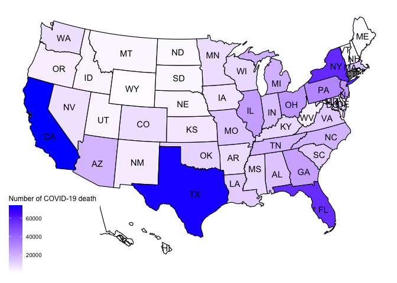
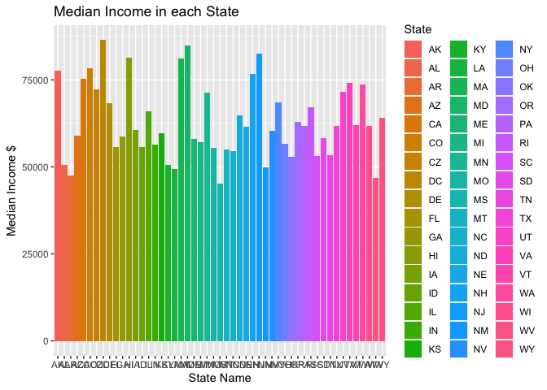
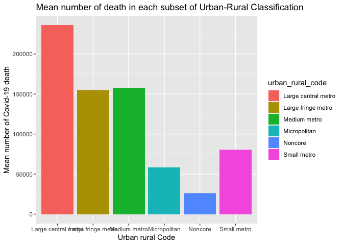
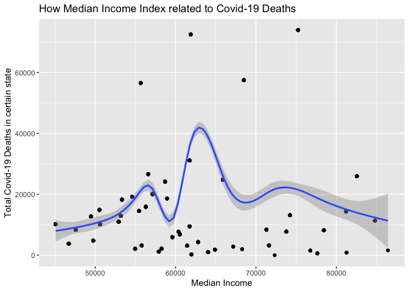

Midterm
================

#### Introduction:

For this project, I am wondering whether the different in people’s
income would influence the death cases in the US. For the first dateset,
I choose to use Median Income for each state in the US provided by
United State Census and the link is
‘<https://www.census.gov/search-results.html?q=Median+income+&page=1&stateGeo=none&searchtype=web&cssp=SERP&_charset_=UTF-8>’.
For the second dateset, I choose to use the collection of Covid-19 cases
and all-causes death cases in each state and county in the US provided
by the CDC and the link is
‘<https://data.cdc.gov/NCHS/Provisional-COVID-19-Death-Counts-in-the-United-St/kn79-hsxy>’.

#### 1.Main Question: Is there an association between Income status and death caused by Covid-19?

#### Method:

I need to merge those two datasets by the variable ‘State’ to get a full
dataset which is helpful for the further analysis. Then, I delete the
comma occurred in some numerical number such as changing 14,500 to 14500
in order to better run the data in R. For the next step, I renamed
certain variables that include ‘space’ like changing “urban rural code”
to “urban\_rual\_code” as a whole word. Before providing some
statistical result, the most important step is to check the missing
value occurs in our data. For any observations with the missing value
for the death cases, I just replaced them with 0. In order to better
summary the key outcome by the variable state, I created new variables
to reflect the total death cases in each state. Then, I created a table
to show the details of each key variable. The table contains four
variables which classified by State: number of counties, Income,
COVID-19 death cases and all-caused death cases. For the data
visualization, I plotted 4 graphs to show the association between each
key variables. For example, I used draw a US map to show the density of
COVID-19 death in each state and draw a scatter plot to reflect the
linear association between Income and number of Covid-19 death cases.

#### 2. Read in the data

``` r
income <- data.table::fread("/Users/websterj/Desktop/median income.csv")
covid <- data.table::fread("/Users/websterj/Desktop/Covid.csv")
```

Merge two dataset

``` r
covid1 <- merge(
  x = income,
  y = covid,
  all.x = TRUE, all.y = FALSE,
  by= "State"
)

covid1<-data.table(covid1)
```

#### 3. Check the data

``` r
#check the dimension of the dataset
dim(covid1)
```

    ## [1] 3023   14

``` r
nrow(covid1)
```

    ## [1] 3023

``` r
ncol(covid1)
```

    ## [1] 14

``` r
# To know the contents of data
str(covid1)
```

    ## Classes 'data.table' and 'data.frame':   3023 obs. of  14 variables:
    ##  $ State           : chr  "AK" "AK" "AK" "AK" ...
    ##  $ State_full_name : chr  "Alaska" "Alaska" "Alaska" "Alaska" ...
    ##  $ Income          : num  77640 77640 77640 77640 77640 ...
    ##  $ Margin Of Error : chr  "+/- $1,015" "+/- $1,015" "+/- $1,015" "+/- $1,015" ...
    ##  $ Lon             : num  61.4 61.4 61.4 61.4 61.4 ...
    ##  $ Lat             : num  -152 -152 -152 -152 -152 ...
    ##  $ Date as of      : chr  "10/20/21" "10/20/21" "10/20/21" "10/20/21" ...
    ##  $ Start Date      : chr  "1/1/20" "1/1/20" "1/1/20" "1/1/20" ...
    ##  $ End Date        : chr  "10/16/21" "10/16/21" "10/16/21" "10/16/21" ...
    ##  $ County name     : chr  "Aleutians East Borough" "Anchorage Municipality" "Bethel Census Area" "Denali Borough" ...
    ##  $ FIPS County Code: int  2013 2020 2050 2068 2070 2090 2105 2110 2122 2130 ...
    ##  $ Urban Rural Code: chr  "Noncore" "Medium metro" "Noncore" "Noncore" ...
    ##  $ Covid_death     : chr  "" "366" "18" "" ...
    ##  $ All_causes_death: chr  "14" "4,133" "194" "11" ...
    ##  - attr(*, ".internal.selfref")=<externalptr> 
    ##  - attr(*, "sorted")= chr "State"

``` r
# Rename some variables
colnames(covid1)[12] <- "urban_rural_code"
colnames(covid1)[10] <-"county_name"

# Check variables
# For two of our variables, they are not in numerical form, so we need to transform it.
covid1$`Covid_death` <- as.numeric(gsub(",","",covid1$`Covid_death`))

covid1$`All_causes_death` <- as.numeric(gsub(",","",covid1$`All_causes_death`))

# Create new variables for total COVID_19 cases in certain State and death in different kind of urban classification.
covid1<-as.data.table(covid1 %>% 
  group_by(State) %>% 
  mutate(
  total_covid_death_instate = sum(Covid_death)
))

covid1<-as.data.table(covid1 %>% 
  group_by(State) %>% 
  mutate(
  total_all_caused_death_instate = sum(All_causes_death)
))

covid1<-as.data.table(covid1 %>% 
  group_by(urban_rural_code) %>% 
  mutate(
  death_mean_urban = mean(Covid_death)
))

# Key Variables
table(covid1$State_full_name)
```

    ## 
    ##              Alabama               Alaska              Arizona 
    ##                   67                   19                   15 
    ##             Arkansas           California             Colorado 
    ##                   73                   56                    1 
    ##          Connecticut             Delaware District of Columbia 
    ##                   57                    3                    1 
    ##              Florida              Georgia               Hawaii 
    ##                   67                  155                    4 
    ##                Idaho             Illinois              Indiana 
    ##                   42                  101                   92 
    ##                 Iowa               Kansas             Kentucky 
    ##                   99                  103                  119 
    ##            Louisiana                Maine             Maryland 
    ##                   62                   15                   24 
    ##        Massachusetts             Michigan            Minnesota 
    ##                   14                   82                   84 
    ##          Mississippi             Missouri              Montana 
    ##                   81                  114                   50 
    ##             Nebraska               Nevada        New Hampshire 
    ##                   79                   16                   10 
    ##           New Jersey           New Mexico             New York 
    ##                   21                   29                   61 
    ##       North Carolina         North Dakota                 Ohio 
    ##                   99                   43                   88 
    ##             Oklahoma               Oregon         Pennsylvania 
    ##                   75                   34                   67 
    ##         Rhode Island       South Carolina         South Dakota 
    ##                    5                   46                   57 
    ##            Tennessee                Texas                 Utah 
    ##                   95                  245                   25 
    ##              Vermont             Virginia           Washington 
    ##                   13                  131                   38 
    ##        West Virginia            Wisconsin              Wyoming 
    ##                   52                   71                   23

``` r
summary(covid1$Income)
```

    ##    Min. 1st Qu.  Median    Mean 3rd Qu.    Max. 
    ##   45081   54602   58700   59991   61973   86420

``` r
summary(covid1$Lon)
```

    ##    Min. 1st Qu.  Median    Mean 3rd Qu.    Max. 
    ##   21.09   34.84   38.46   38.27   41.68   61.37

``` r
summary(covid1$Lat)
```

    ##    Min. 1st Qu.  Median    Mean 3rd Qu.    Max. 
    ## -157.50  -97.56  -89.62  -91.08  -82.76  -69.38

``` r
summary(covid1$total_covid_death_instate)
```

    ##    Min. 1st Qu.  Median    Mean 3rd Qu.    Max.    NA's 
    ##    1512   25922   26585   22817   26585   26585    2895

``` r
summary(covid1$total_all_caused_death_instate)
```

    ##    Min. 1st Qu.  Median    Mean 3rd Qu.    Max.    NA's 
    ##    8363   70288  132315  165184  197070  573696      80

``` r
# Check missing values:
mean(is.na(covid1$Income))
```

    ## [1] 0

``` r
mean(is.na(covid1$`Covid_death`))
```

    ## [1] 0.195832

``` r
mean(is.na(covid1$`All_causes_death`))
```

    ## [1] 0.0006615944

``` r
# We find that there are missing values in the variable: "Death involving COVID-19" and "Deaths from All Causes", what I will do is to assign value 0 to those missing values.
covid1$`Covid_death`[is.na(covid1$`Covid_death`)] <- 0
covid1$`All_causes_death`[is.na(covid1$`All_causes_death`)] <- 0
```

#### Preliminary Results:

We checked the dimension of our data and noticed that there are 3023
total observations and 14 different factors for each of our observation.
Then, I did some summaries for the key variables such as Income,
Covid-19 death cases and all caused death cases. I found the the lowest
median income for people living in certain state is $45081 and highest
median income for people living in certain state is $86420. Also, I
noticed that the lowest death cases caused by COVID-19 is in Colorado
which equals to 0 and highest death cases caused by COVID-19 in
California which equals to 73920 and mean death cases caused by COVID-19
in the US is 20504 for any state. From the data visualization, The first
plot shows that California, Florida, New York and Texas contains much
more COVID-19 death than other states. For the second plot, we noticed
that the range of Income between each state is relatively large which
equals to 41339, Mississippi with the lowest median income which equals
to 45081 and District of Columbia with the highest median income which
equals to 86420. The third graph is about the association between
different urban-rural classification and COVID-19 death cases. We found
that there is a relative positive linear association, as the counties
contains more population, the more COVID-19 death cases occurs. The last
graph is the scatter plot for the association between Income and
COVID-19 death. However, the pattern is not clear and looks like a
normal distribution.

#### 4. Summary statistics in tabular form

``` r
tab <- covid1[, .(
  Number_of_County =length(unique(county_name)),
  Income=unique(Income),
  Covid_death=sum(Covid_death),
  All_death=sum(All_causes_death)
  ),
  by=State]
knitr::kable(tab)
```

| State | Number\_of\_County | Income | Covid\_death | All\_death |
|:------|-------------------:|-------:|-------------:|-----------:|
| AK    |                 19 |  77640 |          601 |       8363 |
| AL    |                 67 |  50536 |        14867 |     114311 |
| AR    |                 73 |  47597 |         8307 |      68003 |
| AZ    |                 15 |  58945 |        18609 |     138229 |
| CA    |                 56 |  75235 |        73920 |     573696 |
| CO    |                 57 |  78444 |         8148 |      82474 |
| CZ    |                  1 |  72331 |            0 |          0 |
| DC    |                  1 |  86420 |         1587 |      12746 |
| DE    |                  3 |  68287 |         1975 |      19245 |
| FL    |                 67 |  55660 |        56495 |     450857 |
| GA    |                155 |  58700 |        24129 |     185638 |
| HI    |                  4 |  81275 |          866 |      21717 |
| IA    |                 99 |  60523 |         6836 |      60088 |
| ID    |                 42 |  55785 |         3169 |      29676 |
| IL    |                101 |  65886 |        24747 |     217893 |
| IN    |                 92 |  56303 |        15866 |     135459 |
| KS    |                103 |  59597 |         5899 |      54058 |
| KY    |                119 |  50589 |        10120 |      98291 |
| LA    |                 62 |  49469 |        12717 |      98182 |
| MA    |                 14 |  81215 |        14323 |     116827 |
| MD    |                 24 |  84805 |        11323 |     103050 |
| ME    |                 15 |  57918 |         1192 |      27590 |
| MI    |                 82 |  57144 |        20073 |     197070 |
| MN    |                 84 |  71306 |         8403 |      88465 |
| MO    |                114 |  55461 |        14532 |     132315 |
| MS    |                 81 |  45081 |        10187 |      70288 |
| MT    |                 50 |  54970 |         2111 |      20864 |
| NC    |                 99 |  54602 |        19228 |     177232 |
| ND    |                 43 |  64894 |         1856 |      14232 |
| NE    |                 79 |  61439 |         3166 |      33065 |
| NH    |                 10 |  76768 |         1512 |      23853 |
| NJ    |                 21 |  82545 |        25922 |     158180 |
| NM    |                 29 |  49754 |         4807 |      39700 |
| NV    |                 16 |  60365 |         7686 |      56609 |
| NY    |                 61 |  68486 |        57508 |     338892 |
| OH    |                 88 |  56602 |        26585 |     248104 |
| OK    |                 75 |  52919 |        10986 |      82606 |
| OR    |                 34 |  62818 |         4307 |      72731 |
| PA    |                 67 |  61744 |        31082 |     269248 |
| RI    |                  5 |  67167 |         2812 |      20327 |
| SC    |                 46 |  53199 |        12924 |     107898 |
| SD    |                 57 |  58275 |         2138 |      16492 |
| TN    |                 95 |  53320 |        18262 |     159485 |
| TX    |                245 |  61874 |        72436 |     457910 |
| UT    |                 25 |  71621 |         3233 |      39219 |
| VA    |                131 |  74222 |        13117 |     142750 |
| VT    |                 13 |  61973 |          283 |      10983 |
| WA    |                 38 |  73775 |         7739 |     113328 |
| WI    |                 71 |  61747 |         9450 |     106051 |
| WV    |                 52 |  46711 |         3752 |      41299 |
| WY    |                 23 |  64049 |          951 |       9748 |

#### 5. Data visualization

``` r
# Using Usmap to show the number of Covid_19 death cases in each state.
covid1<-as.data.table(covid1 %>% 
  group_by(State) %>% 
  mutate(
  total_covid_death_instate = sum(Covid_death)
))

covid2<-covid1
colnames(covid2)[1] <- "state" 
plot_usmap(regions = 'states', data = covid2, values ='total_covid_death_instate', labels = TRUE) +
  scale_fill_continuous(low = "white", high = "blue", name="Number of COVID-19 death")
```

<!-- -->

``` r
# Then, we want to draw a bar graph about the association between State and Income.
income[!is.na(Income)&!is.na(State)] %>%
  ggplot(aes(x=State, y=Income,fill=State))+
  geom_bar(stat='identity')+
  labs(x="State Name",y = expression("Median Income" *~ '$'))+
  ggtitle("Median Income in each State")
```

<!-- -->

``` r
# Urban-Rural Classification VS Covid death
covid1<-as.data.table(covid1 %>% 
  group_by(urban_rural_code) %>% 
  mutate(
  death_mean_urban = mean(Covid_death)
))

covid1[!is.na(urban_rural_code)] %>%
  ggplot(aes(x=urban_rural_code, y=death_mean_urban,fill=urban_rural_code))+
  geom_bar(stat='identity')+
  labs(x="Urban rural Code",y = expression("Mean number of Covid-19 death"))+
  ggtitle("Mean number of death in each subset of Urban-Rural Classification")
```

<!-- -->

``` r
# state income vs total death
ggplot(data=covid1) +
  geom_point(mapping=aes(x=Income, y=total_covid_death_instate))+
  geom_smooth(mapping=aes(x=Income, y=total_covid_death_instate))+
  labs(x="Median Income",y = expression("Total Covid-19 Deaths in certain state"))+
  ggtitle("How Median Income Index related to Covid-19 Deaths")
```

    ## `geom_smooth()` using method = 'gam' and formula 'y ~ s(x, bs = "cs")'

<!-- -->

``` r
# The is no clear pattern for the distribution of the association between Income and number of death.
```

### Conclusion:

We collect the information about the median Income and COVID-19 death
for all 50 States in the US. Four of those state which are LA,TX,NY and
FL have the higher COVID-19 death cases than other states. For the
Median income for people living in CA,TX and NY are over $60,000 which
is a relative large value, but for the linear association between income
and COVID-19 deaths, there is not a clear pattern. For the further
analysis, I would introduce more variables like race, gender to show
whether they confounded the association between income and COVID-19
deaths.
